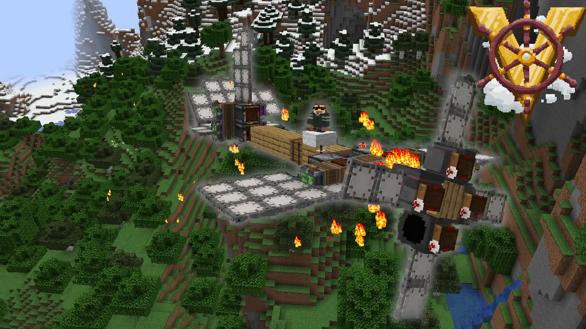
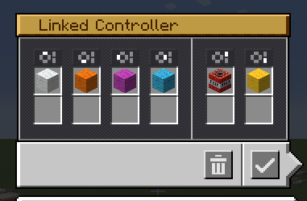

# How to use

1) The schematic uses Eureka ship helms to make it easier to connect with the prop: https://www.curseforge.com/minecraft/mc-mods/eureka-ships
2) Place the two schematic files in your schematics folder in .minecraft
3) You can use create to load the shcmeatics
4) Go to the create config, and set `Link Range` to the max
5) Add a stabilizer to the back of the plane, as the schematic doesnt inculde one
6) Glue all the controll surfaces
7) Connect the prop to the plane with a Takeoff rotor (they connect to blocks nearby, this can be quite finicky though)
8) Make sure to remove the Eureka helms
9) Configure a linked controller like so:

